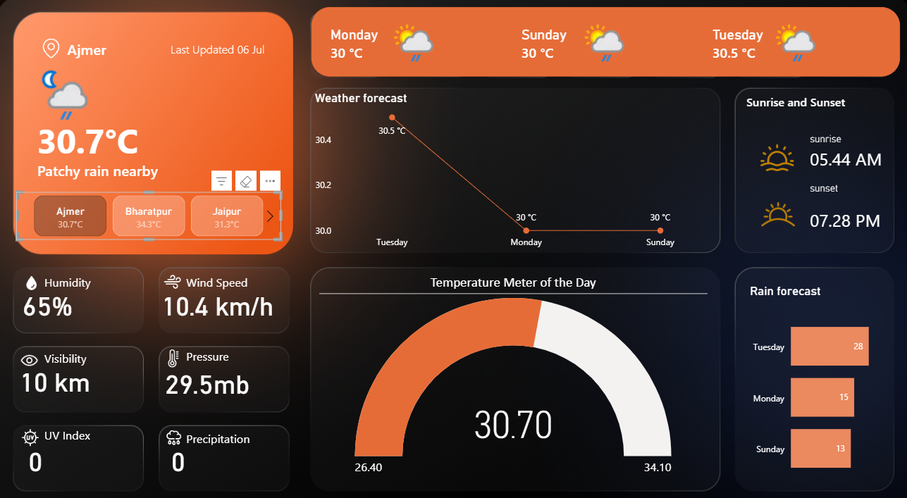

# 🌦️ Weather Forecast Dashboard

[](https://powerbi.microsoft.com/)
[](#)
[](LICENSE)
[](#)

A comprehensive and interactive weather forecast dashboard built with Microsoft PowerBI, featuring real-time weather data integration and professional visualizations.



## 📋 Table of Contents

- [Overview](#-overview)
- [Features](#-features)
- [Dashboard Components](#-dashboard-components)
- [Installation & Setup](#-installation--setup)
- [Usage](#-usage)
- [Data Sources](#-data-sources)
- [Technical Architecture](#-technical-architecture)
- [Screenshots](#-screenshots)
- [Contributing](#-contributing)
- [License](#-license)
- [Contact](#-contact)

## 🌟 Overview

The Weather Forecast Dashboard is a professional-grade business intelligence solution that transforms raw weather data into actionable insights. Built using Microsoft PowerBI, this dashboard provides real-time weather monitoring capabilities with an intuitive and visually appealing interface.

### 🎯 Purpose
- **Real-time Monitoring**: Track current weather conditions across multiple locations
- **Forecast Analysis**: Visualize weather predictions with interactive charts
- **Data-driven Decisions**: Support planning and operational decisions based on weather data
- **Professional Presentation**: Showcase weather information in a business-ready format

## ✨ Features

### 🔄 Real-time Data Integration
- Live weather API connectivity
- Automatic data refresh capabilities
- Multi-location weather tracking
- Historical data comparison

### 📊 Interactive Visualizations
- **Temperature Trends**: Historical and forecasted temperature patterns
- **Precipitation Analysis**: Rain, snow, and humidity metrics
- **Wind Patterns**: Wind speed and direction visualizations
- **UV Index Monitoring**: Solar radiation and safety indicators
- **Visibility Conditions**: Atmospheric clarity measurements

### 🎨 Professional Design
- Custom weather-themed backgrounds
- Comprehensive icon library for weather conditions
- Responsive dashboard layout
- Dark/light theme options

### 📱 User Experience
- Intuitive navigation
- Mobile-responsive design
- Interactive filters and slicers
- Export capabilities

## 🧩 Dashboard Components

| Component | Description | Data Source |
|-----------|-------------|-------------|
| **Current Conditions** | Real-time weather display | Weather API |
| **5-Day Forecast** | Extended weather predictions | Forecast API |
| **Temperature Gauge** | Current temperature with trends | Temperature Sensors |
| **Humidity Meter** | Atmospheric moisture levels | Humidity API |
| **Wind Speed Indicator** | Current wind conditions | Wind Data API |
| **UV Index Display** | Solar radiation measurements | UV Index API |
| **Precipitation Chart** | Rain/snow probability and amounts | Precipitation API |
| **Visibility Monitor** | Atmospheric clarity conditions | Visibility API |

## 🚀 Installation & Setup

### Prerequisites
- Microsoft PowerBI Desktop (Latest version)
- Internet connection for real-time data
- Weather API access (see [Data Sources](#-data-sources))

### Step-by-Step Installation

1. **Clone the Repository**
   ```bash
   git clone https://github.com/yourusername/Weather-Forecast-Dashboard.git
   cd Weather-Forecast-Dashboard
   ```

2. **Open PowerBI File**
   - Launch Microsoft PowerBI Desktop
   - Open `Weather_forecast_Dashboard.pbix`

3. **Configure Data Sources**
   - Navigate to "Transform Data" → "Data source settings"
   - Update API endpoints and authentication keys
   - Test connection to ensure data flow

4. **Refresh Data**
   - Click "Refresh" to load current weather data
   - Verify all visualizations are displaying correctly

5. **Customize Settings** (Optional)
   - Modify refresh intervals
   - Adjust location parameters
   - Configure alert thresholds

## 💡 Usage

### For End Users
1. **Viewing Dashboard**: Open the PowerBI file to view current weather conditions
2. **Filtering Data**: Use location and date filters to focus on specific regions/timeframes
3. **Exporting Reports**: Export visualizations as PDF, PowerPoint, or Excel files
4. **Mobile Access**: Access dashboard through PowerBI mobile app

### For Developers
1. **Data Model Modification**: Edit relationships and calculated measures
2. **Visual Customization**: Modify charts, colors, and layouts
3. **API Integration**: Update data source connections and refresh schedules
4. **Performance Optimization**: Implement data caching and query optimization

## 🔗 Data Sources

### Primary APIs
- **OpenWeatherMap API**: Current weather and forecasts
- **Weather Underground**: Historical weather data
- **UV Index API**: Solar radiation measurements
- **Air Quality API**: Pollution and visibility data

### Data Refresh Schedule
- **Real-time Data**: Every 15 minutes
- **Forecast Data**: Every 6 hours
- **Historical Data**: Daily at midnight

### API Configuration
Refer to [`docs/API_SETUP.md`](docs/API_SETUP.md) for detailed API configuration instructions.

## 🏗️ Technical Architecture

### System Overview
```
┌─────────────────┐    ┌──────────────────┐    ┌─────────────────┐
│   Weather APIs  │───▶│   PowerBI Model  │───▶│   Dashboard UI  │
└─────────────────┘    └──────────────────┘    └─────────────────┘
        │                        │                        │
        ▼                        ▼                        ▼
┌─────────────────┐    ┌──────────────────┐    ┌─────────────────┐
│  Data Sources   │    │  Data Processing │    │  Visualizations │
│  - Current      │    │  - ETL Pipeline  │    │  - Charts       │
│  - Forecast     │    │  - Calculations  │    │  - Gauges       │
│  - Historical   │    │  - Relationships │    │  - Maps         │
└─────────────────┘    └──────────────────┘    └─────────────────┘
```

### Technology Stack
- **Frontend**: Microsoft PowerBI Desktop
- **Data Integration**: PowerBI Data Gateway
- **APIs**: RESTful Weather Services
- **Data Format**: JSON, XML
- **Refresh Method**: Scheduled and On-demand

## 📸 Screenshots

### Main Dashboard View


### Weather Components
| Temperature | Humidity | Wind Speed |
|-------------|----------|------------|
|  |  |  |

*Additional screenshots available in [`docs/SCREENSHOTS.md`](docs/SCREENSHOTS.md)*

## 🤝 Contributing

We welcome contributions! Please read our [Contributing Guidelines](CONTRIBUTING.md) for details on:

- Code of conduct
- Development process
- Submitting pull requests
- Bug reporting
- Feature requests

### Development Workflow
1. Fork the repository
2. Create a feature branch (`git checkout -b feature/AmazingFeature`)
3. Commit changes (`git commit -m 'Add some AmazingFeature'`)
4. Push to branch (`git push origin feature/AmazingFeature`)
5. Open a Pull Request

## 📜 License

This project is licensed under the MIT License - see the [LICENSE](LICENSE) file for details.

## 📞 Contact

**Project Maintainer**: [Your Name]
- Email: your.email@example.com
- LinkedIn: [Your LinkedIn Profile](https://linkedin.com/in/yourprofile)
- GitHub: [@yourusername](https://github.com/yourusername)

**Project Repository**: [Weather-Forecast-Dashboard](https://github.com/yourusername/Weather-Forecast-Dashboard)

---

### 🙏 Acknowledgments

- Microsoft PowerBI team for the excellent BI platform
- Weather API providers for reliable data sources
- Open source community for inspiration and resources
- Icons and design assets contributors

### 📈 Project Status

- **Current Version**: 1.0.0
- **Development Status**: Active
- **Last Updated**: January 2024
- **Next Release**: Q2 2024

---

⭐ **If you found this project helpful, please give it a star!** ⭐